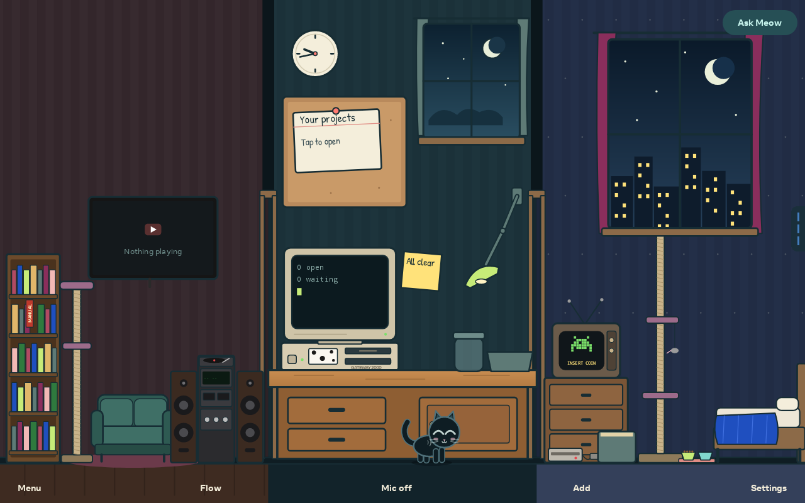
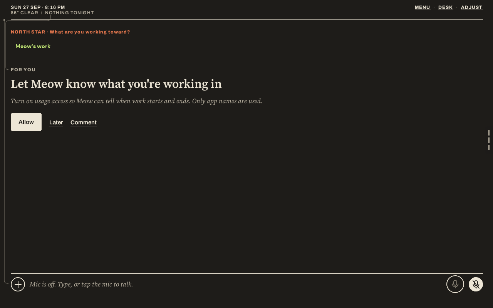

# Meow-Portal

An AI companion and illustrated desk for your Portal, with guided setup for Windows and Mac.

## Release status

**Public Preview 5 is available.** Download the installer app for your computer:

- [Download for Windows](https://github.com/dekayrekords-oss/Meow-Portal/releases/download/portal-5/Meow-Portal-Setup-Windows.exe)
- [Download for Mac](https://github.com/dekayrekords-oss/Meow-Portal/releases/download/portal-5/Meow-Portal-Setup-Mac.dmg)
- [Download the app APK for direct sideloading](https://github.com/dekayrekords-oss/Meow-Portal/releases/download/portal-5/meow-portal.apk)
- [Release notes and checksums](https://github.com/dekayrekords-oss/Meow-Portal/releases/tag/portal-5)

Both apps include Meow **1.5.18-portal.5** and guide you through USB installation. No source-code build or Android Studio is needed. The setup interface opens locally in your browser.

**Already set up for sideloading?** Download `meow-portal.apk` above and use your existing sideloading tool, or run `adb install -r meow-portal.apk` with only your intended Portal connected and authorized. It is the same signed build 5 included in the installers. If you already have build 5, no reinstall is needed. Back up before updating; do not uninstall to bypass a signature or downgrade error.

This preview is not a fully validated production release. Desktop publisher signing/notarization, real Windows USB testing, clean-computer Mac testing and build 5 physical install/update testing remain pending. Your operating system may warn or block opening the installer. Read the release notes before installing. Automatic updates are not enabled; download a newer installer to update.

This edition supports the tested Portal identified by Android as **omni**, running Android 10 with ARM64. Other Portal models are not yet verified. The desktop installers target Windows 10/11 x64 and macOS 13+ on Intel and Apple Silicon.

## How setup works

1. Open the Windows installer or the Mac application.
2. Select **Prepare connection**. The installer reuses installed Android SDK tools, or guides you through downloading verified tools from Google.
3. On Portal, open **Settings → Debug → ADB Enabled**, connect a USB data cable and approve the computer.
4. Select **Install Meow** or **Update / repair Meow** and leave the cable connected until verification finishes.

You must approve debugging on the Portal. The installer cannot enable it before authorization, and does not flash firmware. A compatible Windows USB driver may be required.

## Features

- Illustrated Desk with a companion, room objects and accessible navigation.
- **30 FPS avatar target** for fresh Portal setups. Saved settings are preserved; thermal and idle policies may reduce the actual frame rate.
- Guided compatibility, storage and app-integrity checks.
- In-place updates that do not deliberately clear existing app data.
- Local installer interface without telemetry or API-key collection.

AI provider accounts, credits and optional integrations are configured separately in Meow. Camera, voice and third-party integrations are still undergoing Portal validation. A separate ML Kit camera-optimization worker issue remains under investigation.

## User manual

[Download the offline user manual](https://github.com/dekayrekords-oss/Meow-Portal/raw/refs/heads/main/Meow-Portal-User-Manual.html), then open the downloaded HTML file in your browser. It covers installation, first setup, privacy, backups, updates and troubleshooting. It can also be printed to PDF from your browser.

Before a major update, export an encrypted backup from Meow and save it outside the Portal. Keep the password separately. The installer never needs your AI API keys.

## About this repository

This repository hosts public setup documentation and compiled installer downloads under Releases. The Android application source and signing keys are private and are not included here. Automatic latest-version downloads will be enabled after a stable release is published and tested.

Meow is not affiliated with or endorsed by Meta. Third-party software and services remain subject to their respective terms. No open-source license for the Android application is granted by this repository.
